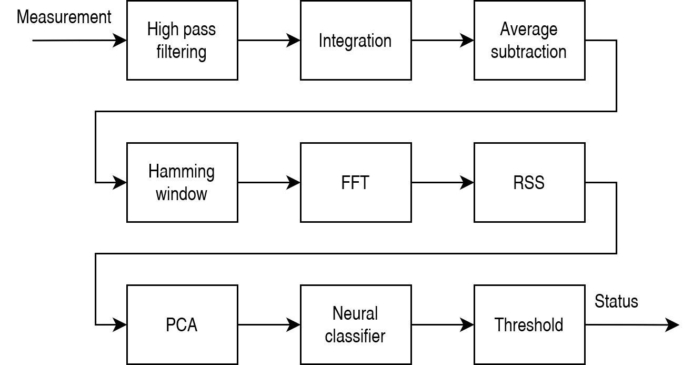

# Thingy-91-Condition-Based-Maintenance

Repository for [Condition based maincenance](https://www.electromaker.io/project/view/contactless-condition-based-maintenance-of-dc-motor), which was submitted for [Make it smart with Nordic Thingy:91](https://www.electromaker.io/contest/make-it-smart-with-nordic-thingy-91) and has won "Edge Impulse Machine Learning Prize".

The main part of this project is a simple Thingy:91 based IoT sensor for condition based maintenance of power generators. The sensor uses built in high G accelerometer to perform vibration classification using FFT, PCA and simple feedforward neural network on the edge. Sensor's outputs are RGB LED visuals (alerts, warnings, info) along with MQTT messages sent over LTE.

Sensor's pipeline can be seen below:

This repository contains source code for the sensor itself as well as project files for simple Arduino based test bench that was used to simulate motor's vibrations during different types of defects.

The test bench can be seen here:

## Folder structure
### Thingy:91 sensor project files
* thingy
  * application - source code for the uC application
  * pca_dataset_collector - Python 3 script that is used to collect samples from the sensor and create C source code with custom PCA algorithm
  * neural_dataset_collector - Python 3 script to collect Edge Impulse friendly dataset from PCA samples obtained from the sensor

### Test bench project files
* workbench
  * controller - Arduino / PlatformIO source code for the workbench controller
  * gui - Python 3 / Qt5 GUI application to control state of the workbench via serial port and MODBUS
  * schematics - KiCAD schematic of the workbench
  * stl - files 3D printable motor and sensors mounts

## Recreating the project
### Test bench
1. Print files from workbench/stl folder and assemble as in image above
2. Connect electronics as in workbench/schematics
3. Upload workbench/controller to Arduino UNO using [PlatformIO](https://platformio.org/install/ide?install=vscode)
4. Now you can run workbench/gui and controll the state of the of the workbench

### Sensor (default)
1. Simply upload the ready to use code from this repo using nrf SDK 1.9.1 and [nRF Connect for VS Code](https://www.nordicsemi.com/Products/Development-tools/nRF-Connect-for-VS-Code)

### Sensor (full pipeline)
1. Uncomment `//#define PRINT_MAGNITUDES` in thingy/application/main.cpp and upload the code to Thingy:91
2. Run thingy/pca_dataset_collector/pca_sample_collector.py for some time changing test bench's state
3. Run thingy/pca_dataset_collector/pca_creator.py
4. Copy thingy/pca_dataset_collector/pca.h and pca.c to thingy/application/include and src folders
5. Comment `//#define PRINT_MAGNITUDES` and uncomment `//#define PRINT_PCA`, then upload the code again
6. Open thingy/neural_sample_collector and change label to given use case (i.e "bearing_fault"), then run it for some time with test bench in the same use case (i.e in bearing fault simulation). Repeat for each use case ("bearing_fault", "motor_throttle", "running", "stopped")
7. Create Edge Impulse model (20Hz sampling frequency, 50ms window increase and 500ms window size) and generate C++ library
8. Overwrite content in thingy/application with source code obtained from new C++ library
10. Comment `//#define PRINT_PCA` and upload the code again
11. Done!
